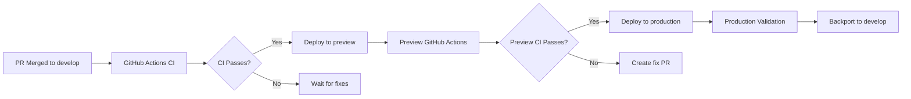

# Deployment Automation Guide

## Overview

This repository uses an automated deployment orchestration system that monitors the `develop` branch and automatically promotes code through `preview` → `production` environments when CI passes.

**Status**: ✅ **ACTIVE**  
**Script**: `./scripts/automated-deployment-loop.sh`  
**Monitoring**: Continuous (60s poll interval)

---

## Architecture



---

## Branch Strategy

| Branch | Purpose | Deployment | CI Required |
|--------|---------|------------|-------------|
| `feature/*` | Development work | None | Yes (on PR) |
| `develop` | Integration testing | None | Yes (on push) |
| `preview` | Pre-production validation | Vercel Preview | Yes (on push) |
| `production` | Live system | Vercel Production | Yes (on push) |

---

## Automated Workflow

### 1. Developer Creates PR
```bash
git checkout -b feature/my-improvement
# Make changes
git commit -m "add improvement"
git push origin feature/my-improvement
gh pr create --base develop
```

### 2. PR Review & Merge
- Reviewer approves PR
- PR merged to `develop`
- **Automation takes over** ⚡

### 3. Deployment Loop Actions

#### Stage 1: Monitor develop
- Polls `develop` every 60s for new commits
- Detects merge: `git fetch && git diff`

#### Stage 2: Wait for CI
- Monitors GitHub Actions on `develop`
- Waits for all checks to pass (lint, typecheck, test, build)
- Retries if transient failures

#### Stage 3: Deploy to Preview
```bash
git checkout preview
git merge develop --no-edit
git push origin preview
```
- Triggers `.github/workflows/deploy.yml`
- Runs migrations on preview database
- Deploys to Vercel preview environment
- Waits for deployment GitHub Actions

#### Stage 4: Deploy to Production
```bash
git checkout production  
git merge preview --no-edit
git push origin production
```
- Triggers production deployment workflow
- Runs migrations on production database
- Deploys to Vercel production
- Waits for deployment completion

#### Stage 5: Post-Deployment
- Runs `./scripts/validate-deployment.sh`
- Verifies health endpoint
- Checks database connectivity
- Validates API responses

#### Stage 6: Backport
- Merges `preview` and `production` back to `develop`
- Ensures hotfixes don't get lost
- Maintains branch synchronization

---

## Starting the Deployment Loop

### Production (Recommended)
```bash
# Run in background with logging
nohup ./scripts/automated-deployment-loop.sh > /tmp/deployment-loop.log 2>&1 &

# Save PID
echo $! > /tmp/deployment-loop.pid

# Monitor output
tail -f /tmp/deployment-loop.log
```

### Development (Testing)
```bash
# Run in foreground for debugging
./scripts/automated-deployment-loop.sh

# Or with custom poll interval
POLL_INTERVAL=30 ./scripts/automated-deployment-loop.sh
```

---

## Monitoring

### Check Loop Status
```bash
# Check if running
ps aux | grep automated-deployment-loop | grep -v grep

# View recent activity
tail -50 /tmp/deployment-loop.log

# Follow live output
tail -f /tmp/deployment-loop.log
```

### Health Indicators
```bash
# ✅ Healthy output:
[✓] No new commits on develop (current: abc123)
[✓] Open PRs targeting develop: 5
[✓] Sleeping for 60s...

# ⚡ Deploying:
[✓] New commits detected on develop
[✓] GitHub Actions status: in_progress, waiting...
[✓] All GitHub Actions passed
[✓] Merged develop into preview
[✓] Pushed to preview branch

# ❌ Issue detected:
[✗] GitHub Actions failed on develop
[✗] Preview deployment failed
```

---

## Safety Features

### Never Bypasses CI
- Waits for **all** GitHub Actions checks
- No deployment if any check fails
- Requires manual fix if CI broken

### Never Force-Pushes
- Uses `git merge --no-edit` only
- Preserves full commit history
- Maintains git graph integrity

### Creates Fix PRs on Issues
- Detects deployment failures
- Documents issue in PR
- Requests manual intervention
- Never auto-merges fixes

### Comprehensive Logging
- Timestamps all actions
- Records SHA hashes
- Logs GitHub Actions results
- Tracks deployment URLs

---

## Configuration

### Environment Variables
```bash
# Optional: Override poll interval (seconds)
export POLL_INTERVAL=120

# Optional: Override production URL
export PRODUCTION_URL=https://custom-domain.com
```

### Prerequisites
- `gh` CLI configured with authentication
- `git` configured with push access
- Vercel project connected to repository
- GitHub Actions enabled and working

---

## Troubleshooting

### Loop Not Starting
```bash
# Check script permissions
chmod +x ./scripts/automated-deployment-loop.sh

# Check for syntax errors
bash -n ./scripts/automated-deployment-loop.sh

# Run with debug output
bash -x ./scripts/automated-deployment-loop.sh
```

### Deployment Stuck
```bash
# Check GitHub Actions status
gh run list --branch develop --limit 5

# Check Vercel deployment status
vercel list

# Manually verify preview deployment
./scripts/validate-deployment.sh https://preview-url.vercel.app preview
```

### Merge Conflicts
```bash
# Loop will detect conflict and create PR
# Manually resolve:
git checkout preview
git merge develop
# Fix conflicts
git commit
git push origin preview
```

---

## Stopping the Loop

### Graceful Shutdown
```bash
# Send SIGTERM to allow cleanup
kill $(cat /tmp/deployment-loop.pid)

# Loop will:
# - Checkout develop branch
# - Clean up temp files
# - Exit gracefully
```

### Force Stop
```bash
# Only if graceful shutdown hangs
kill -9 $(cat /tmp/deployment-loop.pid)
```

---

## Manual Deployment Override

### Emergency Hotfix to Production
```bash
# Create hotfix branch from production
git checkout production
git checkout -b hotfix/critical-security-fix

# Make fix
git commit -m "fix critical security issue"

# Deploy directly (bypass automation)
git checkout production
git merge hotfix/critical-security-fix
git push origin production

# Backport to develop
git checkout develop  
git merge hotfix/critical-security-fix
git push origin develop

# Loop will detect and synchronize
```

### Preview-Only Deployment
```bash
# Useful for testing without affecting production
git checkout preview
git merge feature/experimental --no-ff
git push origin preview

# Loop will NOT deploy to production
# (only automatic on develop → preview → production flow)
```

---

## Metrics & Reporting

### Deployment Frequency
```bash
# Count deployments in last 24 hours
grep "Production deployment complete" /tmp/deployment-loop.log | \
  grep "$(date '+%Y-%m-%d')" | wc -l
```

### Average Deploy Time
```bash
# Extract deployment durations from logs
grep -A 5 "Deploying develop to preview" /tmp/deployment-loop.log | \
  grep "deployment completed in"
```

### Failure Rate
```bash
# Count failed deployments
grep "deployment failed" /tmp/deployment-loop.log | wc -l
```

---

## Best Practices

### For Developers

✅ **DO**:
- Ensure PRs pass all CI checks before merging
- Write descriptive commit messages
- Test changes locally with `./scripts/check.sh`
- Merge small, focused PRs frequently
- Monitor deployment loop after merge

❌ **DON'T**:
- Merge PRs with failing CI
- Push directly to `develop`, `preview`, or `production`
- Bypass pre-commit hooks with `--no-verify`
- Merge large, risky changes at end of day

### For Reviewers

✅ **DO**:
- Verify CI passes before approving
- Check for deployment risks (migrations, env vars)
- Approve smaller PRs quickly
- Monitor first deployment after merge

❌ **DON'T**:
- Approve without CI passing
- Merge multiple large PRs simultaneously
- Ignore deployment loop warnings

---

## Integration with CI/CD

### GitHub Actions Workflows

**`.github/workflows/ci.yml`**:
- Runs on PR to `develop`
- Blocks merge if failing
- Required for automation to proceed

**`.github/workflows/deploy.yml`**:
- Triggers on push to `preview` or `production`
- Runs migrations
- Deploys to Vercel
- Validates deployment

### Vercel Integration
- **Preview deployments**: Automatic on `preview` branch push
- **Production deployments**: Automatic on `production` branch push
- **Environment variables**: Managed in Vercel dashboard
- **Database**: Neon PostgreSQL with branch-specific connections

---

## Security Considerations

### Credentials
- Loop uses local `gh` CLI authentication
- No credentials stored in script
- Requires GitHub PAT with `repo` scope
- Vercel token managed by GitHub Secrets

### Access Control
- Only merges PRs already approved
- Cannot modify code (only merges branches)
- Cannot bypass branch protection rules
- Cannot access secrets or env vars

### Audit Trail
- All actions logged with timestamps
- Git history preserved (no force-pushes)
- GitHub Actions provide additional audit
- Deployment URLs recorded in logs

---

## Future Enhancements

### Planned
- [ ] Slack/Discord notifications on deployment
- [ ] Prometheus metrics export
- [ ] Automated rollback on health check failure
- [ ] Canary deployment support
- [ ] Blue-green deployment strategy
- [ ] Integration with feature flags

### Ideas
- Database migration validation before deployment
- Load testing integration
- Security scanning automation
- Dependency vulnerability checks
- Performance regression detection

---

## Support

### Questions?
- Check deployment loop logs: `/tmp/deployment-loop.log`
- Review GitHub Actions: `gh run list`
- Check Vercel dashboard: https://vercel.com/dashboard

### Issues?
- Create issue: `gh issue create`
- Tag with `deployment` label
- Include logs from `/tmp/deployment-loop.log`

### Contributing
- Improvements to automation welcome
- Test changes in fork first
- Document new features

---

**Version**: 1.0  
**Last Updated**: 2025-11-06  
**Maintained By**: Care Commons Team  
**License**: Same as project
